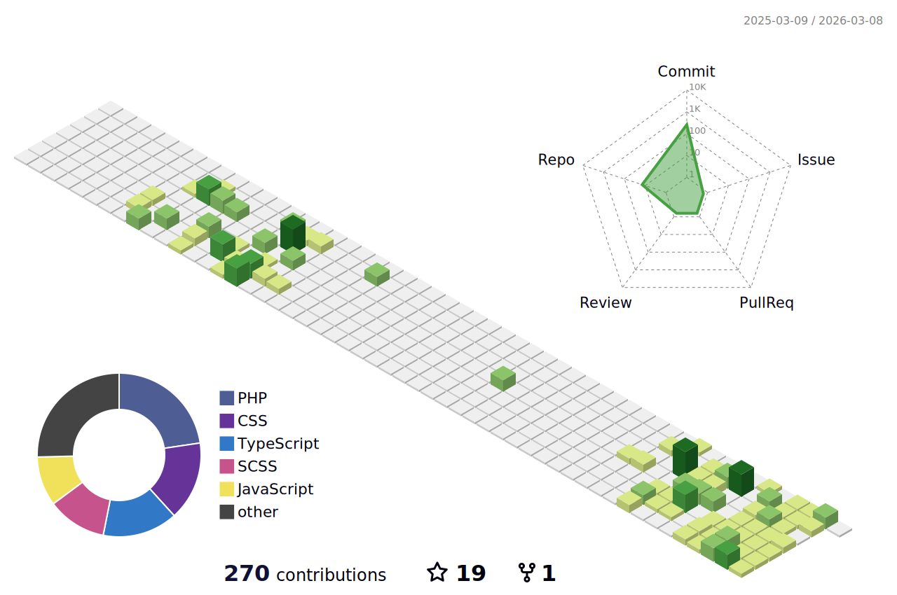

|                 **Property**                    |                   **Data**                          |
|-------------------------------------------------|-----------------------------------------------------|
| **Language / IDE**                              |      |
| **Domain Knowledge**                            |    |
| **CI / CD**                                     |    |
| **Databases**                                   |    |
| **Machine Learning / Deep Learning Frameworks** |     |
| **AI Agent Frameworks**                         |   |

### 📈 GitHub Activity Graph:

**📫 How to Reach me:**

        
        
        

